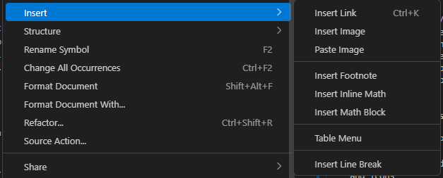
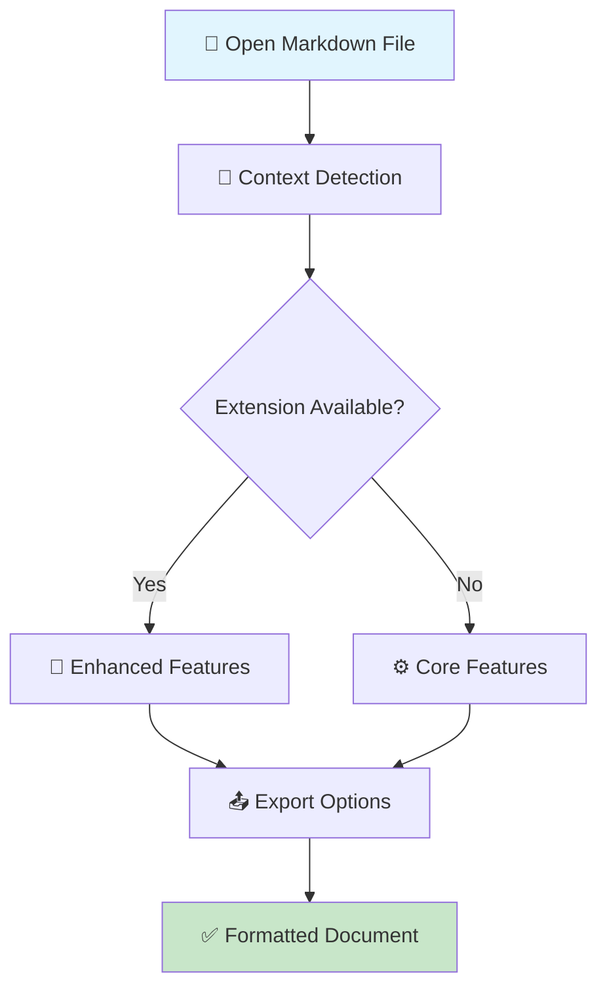
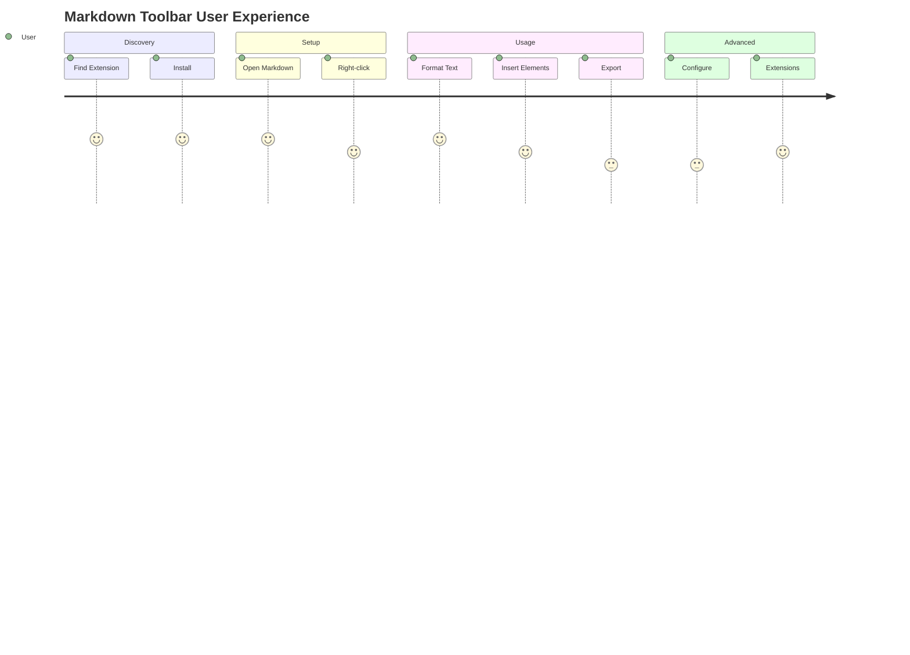
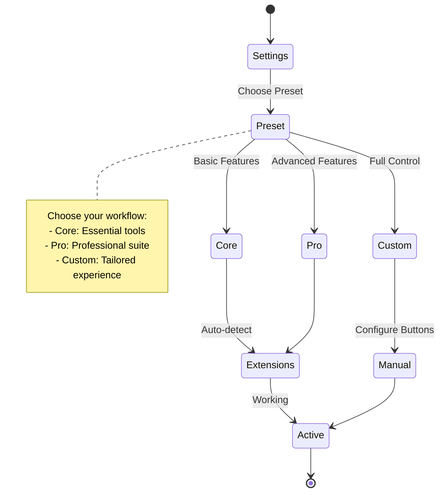
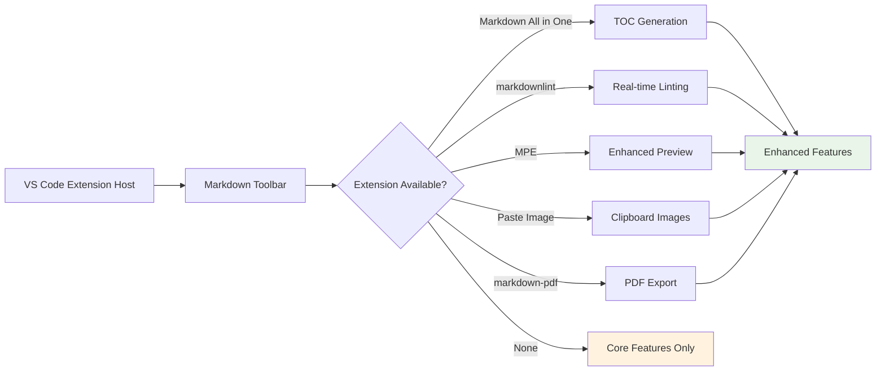
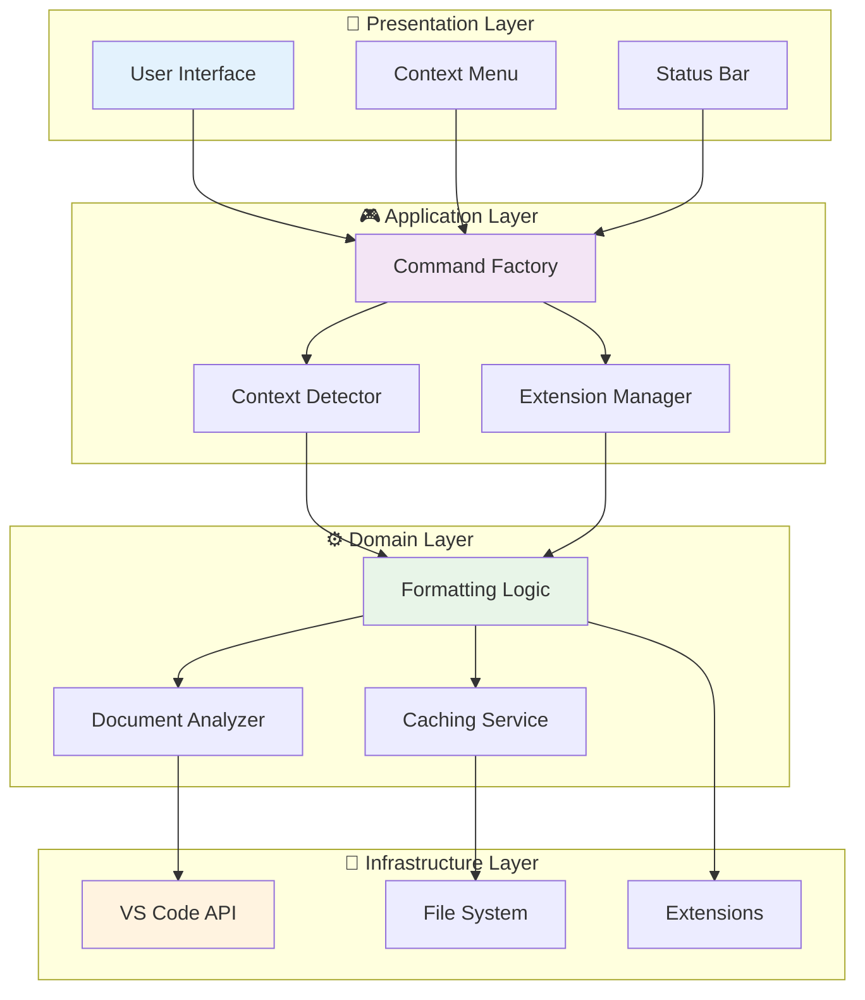
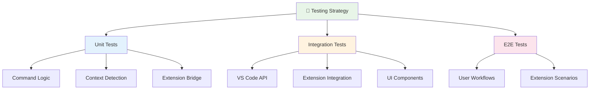
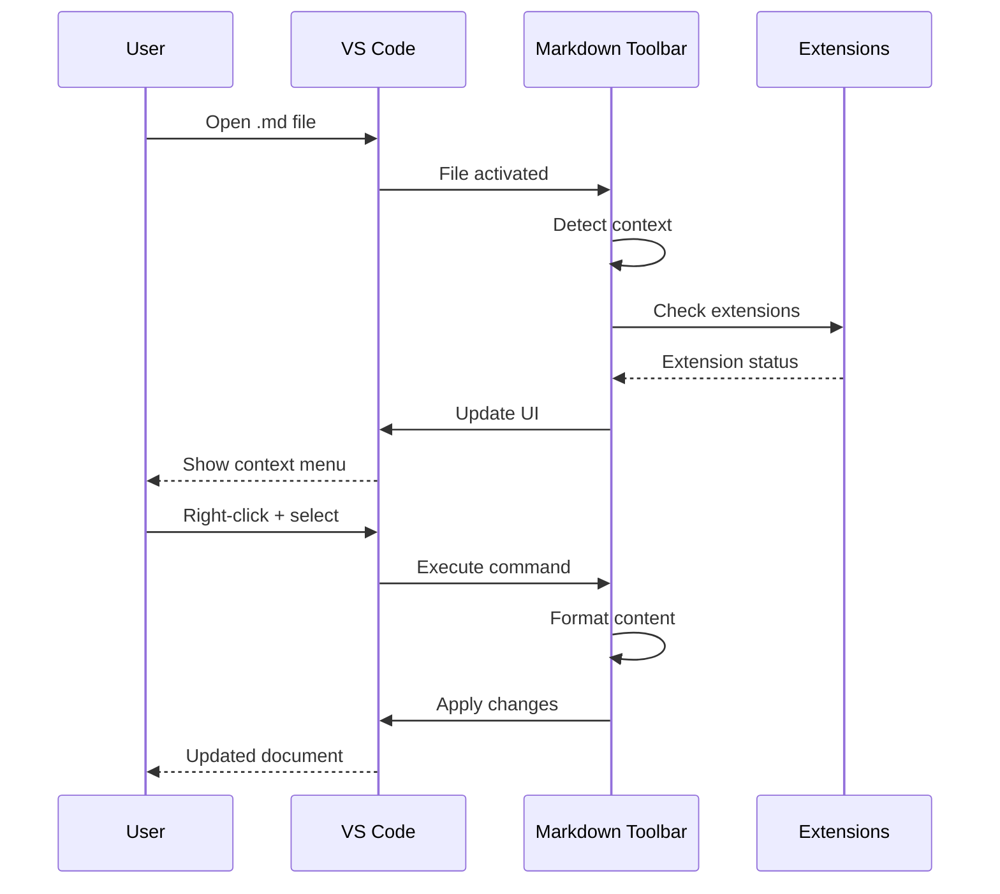
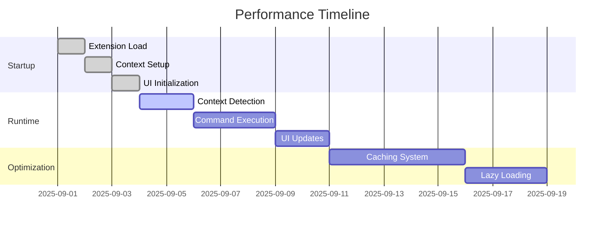
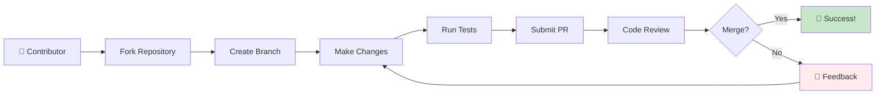

<p align="center">

</p>


<p align="center">
   
  <a href="https://github.com/GSejas/markdown-toolbar"></a>
  <a href="https://code.visualstudio.com/"></a>
  <a href="https://www.typescriptlang.org/"></a>
  <br>
  
  
</p>

A powerful VS Code extension that provides intelligent markdown formatting tools with real-time context awareness and seamless extension integration.


## $(target) Smart Context Detection

- $(search) Automatically detects cursor position and document context
- $(gear) Buttons adapt based on current selection and content  
- $(extensions) Works seamlessly with popular markdown extensions

## $(tools) Comprehensive Toolset

- **$(bold) Text Formatting**: Bold, italic, strikethrough, inline code, highlight
- **$(list-unordered) Document Structure**: Headings, lists, blockquotes, code blocks, tables
- **$(link) Media & Links**: Image insertion, link creation, footnote support
- **$(rocket) Advanced Features**: Math expressions, Mermaid diagrams, TOC generation

### 🔧 Context Menu Integration

Right-click in any markdown file to access organized formatting options:


| Format                        | Headings                      | New Column                               | New Column |
| ----------------------------- | ----------------------------- | ---------------------------------------- | ---------- |
|  |  |  |     |

```bash
📝 Format Text    🏗️ Structure    ➕ Insert    ⚙️ Editor Features
├── Bold          ├── Headings    ├── Links   ├── Word Wrap
├── Italic        ├── Lists       ├── Images  ├── Line Numbers
├── Code          ├── Blockquotes ├── Tables  └── Minimap
└── Highlight     └── Code Blocks └── Footnotes
```

### 📊 Workflow Overview



## $(download) Installation & Quick Start

### $(extensions) VS Code Marketplace

1. $(code) Open VS Code
2. $(search) Go to Extensions (`Ctrl+Shift+X`)
3. $(magnify) Search for "Markdown Toolbar"
4. $(cloud-download) Click **Install**

### $(file-text) First Use

1. $(file-code) Open any `.md` file
2. $(menu) Right-click to see the context menu
3. $(rocket) Start formatting with intelligent tools!

### $(zap) Performance Features

Access new performance diagnostics:
- **Command Palette** → `Markdown Toolbar: Performance Diagnostics`
- **$(graph) Real-time metrics**: Cache hit rates, memory usage, operation timing
- **$(pulse) 50%+ faster** document processing with LRU caching
- **$(shield) Zero crashes** with comprehensive error boundaries

```bash
# Quick commands
Ctrl+Shift+P → "Markdown Toolbar: Switch Preset"
Ctrl+Shift+P → "Markdown Toolbar: Analyze Dependencies"
```

### � User Journey



## �🎨 Visual Examples

### Basic Formatting

```markdown
# Start with plain text
This is regular text content.

# Apply formatting
**This becomes bold text**
*This becomes italic text*
`This becomes inline code`
```

### Advanced Features

```markdown
# Tables
| Feature | Status |
|---------|--------|
| Context Menu | ✅ |
| PDF Export | ✅ |

# Code Blocks
```javascript
function formatText(text) {
  return `**${text}**`; // Bold formatting
}
```

### 📋 Feature Comparison

```text
╔══════════════════════════════════════════════════════════════╗
║                    Feature Matrix                           ║
╠══════════════════════════════════════╦═══════╦═══════╦═══════╣
║ Feature                            ║ Core  ║ Pro   ║ Full  ║
╠══════════════════════════════════════╬═══════╬═══════╬═══════╣
║ ✅ Basic Formatting (Bold/Italic)   ║   ✓   ║   ✓   ║   ✓   ║
║ ✅ Lists & Headings                 ║   ✓   ║   ✓   ║   ✓   ║
║ ✅ Links & Images                   ║   ✓   ║   ✓   ║   ✓   ║
║ ✅ Code Blocks                      ║   ✓   ║   ✓   ║   ✓   ║
║ ✅ Context Menu                     ║   ✓   ║   ✓   ║   ✓   ║
║ 🔧 Table of Contents               ║   ○   ║   ✓   ║   ✓   ║
║ 🔧 Real-time Linting               ║   ○   ║   ✓   ║   ✓   ║
║ 🔧 Enhanced Preview                ║   ○   ║   ○   ║   ✓   ║
║ 🔧 Image Paste                     ║   ○   ║   ○   ║   ✓   ║
║ 🔧 PDF Export                      ║   ○   ║   ○   ║   ✓   ║
╚══════════════════════════════════════╩═══════╩═══════╩═══════╝
    ✓ = Included    ○ = Requires Extension    🔧 = Enhanced
```

## ⚙️ Configuration

### Basic Settings

```json
{
  "markdownToolbar.preset": "core",
  "markdownToolbar.statusBar.enabled": true,
  "markdownToolbar.autoDetectDependencies": true
}
```

### Advanced Options

```json
{
  "markdownToolbar.contextUpdateDebounce": 100,
  "markdownToolbar.fallbackBehavior": "internal",
  "markdownToolbar.showMissingExtensionNotifications": true
}
```

### 🎛️ Configuration Flow



## 🧩 Extension Compatibility

| Extension | Features Unlocked | Status |
|-----------|------------------|---------|
| **Markdown All in One** | TOC, Advanced Formatting | ✅ Auto-detected |
| **markdownlint** | Real-time Linting | ✅ Auto-detected |
| **Markdown Preview Enhanced** | Enhanced Previews | ✅ Auto-detected |
| **Paste Image** | Direct Image Pasting | ✅ Auto-detected |
| **markdown-pdf** | PDF Export | ✅ Auto-detected |

### � Extension Integration Flow



### 📦 Extension Ecosystem

```text
🌟 VS Code Marketplace
        │
        ├── 📚 Markdown All in One
        │   ├── Table of Contents
        │   ├── Auto-formatting
        │   └── Keyboard shortcuts
        │
        ├── 🔍 markdownlint
        │   ├── Real-time linting
        │   ├── Fix suggestions
        │   └── Workspace analysis
        │
        ├── 👁️ Markdown Preview Enhanced
        │   ├── Rich previews
        │   ├── Export options
        │   └── Diagram support
        │
        └── 📝 Markdown Toolbar (This!)
            ├── Context-aware UI
            ├── Extension integration
            └── Smart fallbacks
```

## �📊 Architecture Overview

```text
┌─────────────────────────────────────────────────────────────┐
│                    🎯 USER INTERFACE                        │
├─────────────────────────────────────────────────────────────┤
│  ┌─────────────┐    ┌─────────────┐    ┌─────────────┐     │
│  │  Status Bar │    │ Context     │    │ Settings    │     │
│  │             │    │   Menu      │    │   Panel     │     │
│  │ • Preset    │◄──►│ • Commands  │◄──►│ • Options   │     │
│  │   Switcher  │    │ • Context   │    │ • Advanced  │     │
│  │             │    │   Aware     │    │   Config    │     │
│  └─────────────┘    └─────────────┘    └─────────────┘     │
└─────────────────────────────────────────────────────────────┘
                                 │
                    ┌─────────────────────┐
                    │   🎮 COMMAND LAYER  │
                    │                     │
                    │ • Command Factory   │
                    │ • Extension Bridge  │
                    │ • Context Detection │
                    └─────────────────────┘
                                 │
                    ┌─────────────────────┐
                    │   ⚙️ ENGINE LAYER   │
                    │                     │
                    │ • Formatting Logic  │
                    │ • Document Analysis │
                    │ • Extension API     │
                    └─────────────────────┘
                                 │
                    ┌─────────────────────┐
                    │   🔧 SERVICE LAYER  │
                    │                     │
                    │ • Extension Mgmt    │
                    │ • Caching System    │
                    │ • State Persistence │
                    └─────────────────────┘
```

### 🏗️ System Architecture Flow



## 🧪 Testing & Quality

### Test Coverage

- ✅ **Unit Tests**: 230+ tests passing
- ✅ **Integration Tests**: 9 tests passing
- ✅ **TypeScript**: 100% type safety
- ✅ **ESLint**: Code quality enforcement

### Quality Assurance

- **Automated Testing**: CI/CD integration
- **Performance Monitoring**: Optimized for large documents
- **Extension Compatibility**: Verified with popular extensions

### 🧪 Testing Pyramid



## 🎮 Usage Examples

### Context Menu Workflow

```bash
# 1. Open markdown file
# 2. Right-click anywhere
# 3. Choose from categories:
#    - Format Text (bold, italic, code)
#    - Structure (headings, lists)
#    - Insert (links, images, tables)
#    - Tools (lint, preview)
# 4. Formatting applied instantly
```

### Keyboard Shortcuts

```bash
Ctrl+B         # Bold
Ctrl+I         # Italic
Ctrl+Shift+C   # Inline code
Ctrl+K         # Insert link
Ctrl+Shift+L   # Toggle list
```

### 🎯 Interactive Workflow



## 🔧 Development

### Setup

```bash
git clone https://github.com/GSejas/markdown-toolbar
cd markdown-toolbar
npm install
npm run watch
```

### Build Commands

```bash
npm run compile      # Type check + lint + build
npm run test         # Run all tests
npm run package      # Production build
```

### Project Structure

```text
src/
├── commands/        # Command implementations
├── engine/          # Core formatting logic
├── services/        # Extension detection & caching
├── types/           # TypeScript definitions
├── ui/              # Status bar & UI components
└── utils/           # Helper functions
```

### 🏗️ Development Workflow


## 📈 Performance

### Benchmarks

- **Context Detection**: < 50ms for large documents
- **Extension Scanning**: < 100ms on startup
- **Memory Usage**: < 10MB additional
- **UI Responsiveness**: 60fps smooth interaction

### Optimizations

- **Smart Caching**: Document analysis results cached
- **Debounced Updates**: Prevents UI flicker during typing
- **Lazy Loading**: Extensions loaded on-demand
- **Atomic Operations**: Undo-friendly single edits

### ⚡ Performance Metrics



## 🤝 Contributing

We welcome contributions! Here's how to get involved:

### Ways to Contribute

- 🐛 **Bug Reports**: Use GitHub Issues
- ✨ **Feature Requests**: Suggest new capabilities
- 📖 **Documentation**: Improve guides and examples
- 🧪 **Testing**: Add test cases or improve coverage
- 💻 **Code**: Submit pull requests

### Development Workflow

```bash
# 1. Fork the repository
# 2. Create feature branch
git checkout -b feature/amazing-feature

# 3. Make changes and test
npm run test
npm run lint

# 4. Submit pull request
```

### 🤝 Contribution Flow



## 📄 License

**MIT License** - Free for personal and commercial use

## 🙏 Acknowledgments

- **VS Code Team**: For the excellent extension API
- **Markdown Community**: For inspiration and standards
- **Contributors**: For making this project better

---

Made with ❤️ for the Markdown community

[⭐ Star on GitHub](https://github.com/GSejas/markdown-toolbar) • [🐛 Report Issues](https://github.com/GSejas/markdown-toolbar/issues)
