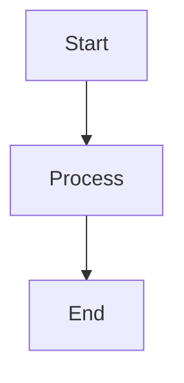

# 📖 Markdown Extended Toolbar - User Guide & Test Plan

> **Complete guide for using the Markdown Extended Toolbar extension with step-by-step testing scenarios**

[](https://github.com/GSejas/markdown-toolbar)
[](https://code.visualstudio.com/)

## 🎯 Overview

This guide serves dual purposes:
1. **User Guide**: Learn how to use all features effectively
2. **Test Plan**: Verify that all functionality works correctly after installation

## 📋 Quick Start Checklist

- [ ] Extension installed and activated
- [ ] Markdown file open (.md extension)
- [ ] Status bar toolbar visible
- [x] Context detection working

---

## 🚀 Getting Started

### ✅ Test 1: Extension Activation

**Objective**: Verify the extension activates properly

1. **Open VS Code**
2. **Create or open a markdown file** (`.md` extension)
3. **Check the status bar** (bottom of VS Code window)

**Expected Results**:
- ✅ Markdown Extended Toolbar appears in status bar
- ✅ Extension activates automatically
- ✅ No error messages in console

**Demo Placeholder**: `[📹 DEMO: Extension Activation]`

---

## 🎨 Core Formatting Features

### ✅ Test 2: Basic Text Formatting

**Objective**: Test bold, italic, and code formatting

#### Bold Text
1. Select text: `important text`
2. Click **Bold** button or use command palette: `Markdown: Toggle Bold`
3. Result: `**important text**`

#### Italic Text  
1. Select text: `emphasized text`
2. Click **Italic** button or use command palette: `Markdown: Toggle Italic`
3. Result: `*emphasized text*`

#### Inline Code
1. Select text: `console.log`
2. Click **Code** button or use command palette: `Markdown: Toggle Code`
3. Result: `\`console.log\``

**Expected Results**:
- ✅ Formatting applied correctly
- ✅ Context-aware toggle (removes formatting if already present)
- ✅ Status bar buttons respond appropriately

**Demo Placeholder**: `[📹 DEMO: Basic Text Formatting]`

---

### ✅ Test 3: Link Management

**Objective**: Test link insertion and extraction

#### Insert Link
1. Select text: `VS Code`
2. Click **Link** button or use command palette: `Markdown: Toggle Link`
3. Enter URL when prompted: `https://code.visualstudio.com`
4. Result: `[VS Code](https://code.visualstudio.com)`

#### Extract Link
1. Place cursor inside existing link: `[VS Code](https://code.visualstudio.com)`
2. Click **Link** button
3. Result: Link URL shown in notification + text becomes: `VS Code`

**Expected Results**:
- ✅ Link creation dialog appears
- ✅ Link extraction works and shows URL
- ✅ Smart detection of existing links

**Demo Placeholder**: `[📹 DEMO: Link Management]`

---

### ✅ Test 4: List Formatting

**Objective**: Test bullet and numbered list creation

#### Create Bullet List
1. Select multiple lines:
   ```
   First item
   Second item
   Third item
   ```
2. Click **List** button or use command palette: `Markdown: Toggle List`
3. Result:
   ```
   - First item
   - Second item
   - Third item
   ```

#### Mixed List Normalization
1. Start with mixed list:
   ```
   * Item one
   1. Item two
   - Item three
   ```
2. Select all lines and click **List** button
3. Result: All normalized to bullet points

**Expected Results**:
- ✅ Consistent bullet formatting applied
- ✅ Line expansion works correctly
- ✅ Mixed list types normalized

**Demo Placeholder**: `[📹 DEMO: List Management]`

---

## 📊 Advanced Features

### ✅ Test 5: Header CodeLens Actions

**Objective**: Test interactive header management

#### Setup Test Document
Create a markdown file with headers:
```markdown
# Main Title

Some content here.

## Subsection A

More content.

### Details

Detailed information.

## Subsection B

Final content.
```

#### Test Header Actions
1. **Copy Link**: Click "Copy Link" above any header
   - ✅ Link copied to clipboard: `[Header Text](#header-anchor)`

2. **Move Up/Down**: Use arrow buttons to reorder sections
   - ✅ Entire sections move with content preserved

3. **Copy Section**: Click "Copy Section" above header with content
   - ✅ Full section including content copied

4. **Fold/Unfold**: Click fold button on headers with content
   - ✅ Section content toggles visibility

**Expected Results**:
- ✅ CodeLens appears above each header
- ✅ All actions work without errors
- ✅ Content preservation during moves

**Demo Placeholder**: `[📹 DEMO: Header Management]`

---

### ✅ Test 6: Table CodeLens Actions

**Objective**: Test interactive table management

#### Setup Test Table
Create a table in markdown:
```markdown
| Name | Age | City |
|------|-----|------|
| John | 25  | NYC  |
| Jane | 30  | LA   |
```

#### Test Table Actions
1. **Add Row**: Click "➕ Row" above table
   - ✅ New empty row added at bottom

2. **Add Column**: Click "➕ Column" above table  
   - ✅ New column added with proper alignment

3. **Format Table**: Click "🔄 Format" above table
   - ✅ Table columns aligned properly

4. **Sort**: Click "⬆️ Sort" to sort by first column
   - ✅ Rows reordered alphabetically

**Expected Results**:
- ✅ CodeLens appears above tables
- ✅ Table structure maintained
- ✅ Alignment preserved

**Demo Placeholder**: `[📹 DEMO: Table Management]`

---

### ✅ Test 7: Mermaid Diagram Support

**Objective**: Test Mermaid diagram CodeLens

#### Setup Test Diagram
Create a Mermaid diagram:
````markdown

````

#### Test Mermaid Actions
1. **Export**: Click export button above diagram
   - ✅ Export options appear (PNG, SVG, etc.)

2. **Validate**: Automatic syntax validation
   - ✅ No errors for valid syntax
   - ✅ Warnings for invalid syntax

**Expected Results**:
- ✅ CodeLens appears above Mermaid blocks
- ✅ Syntax validation works
- ✅ Export functionality available

**Demo Placeholder**: `[📹 DEMO: Mermaid Diagrams]`

---

### ✅ Test 8: Checkbox Management

**Objective**: Test interactive checkbox features

#### Setup Test Checkboxes
Create checkboxes in markdown:
```markdown
- [ ] Incomplete task
- [x] Completed task
- [ ] Another task
  - [ ] Nested task
  - [x] Nested completed
```

#### Test Checkbox Actions
1. **Toggle State**: Click CodeLens buttons to toggle checkboxes
   - ✅ `[ ]` becomes `[x]` and vice versa

2. **Progress Tracking**: Observe hover information
   - ✅ Shows completion percentage
   - ✅ Displays task count

3. **Nested Checkboxes**: Test indented checkboxes
   - ✅ Nested items handled correctly

**Expected Results**:
- ✅ CodeLens appears for checkbox lines
- ✅ Toggle functionality works
- ✅ Progress tracking accurate

**Demo Placeholder**: `[📹 DEMO: Checkbox Management]`

---

## ⚙️ Configuration & Settings

### ✅ Test 9: Preset Configuration

**Objective**: Test different toolbar presets

#### Test Presets
1. **Core Preset** (Default):
   - Open settings: `Markdown Extended Toolbar: Preset`
   - Select "core"
   - ✅ Basic formatting buttons visible

2. **Writer Preset**:
   - Select "writer" preset
   - ✅ Writing-focused tools appear

3. **Pro Preset**:
   - Select "pro" preset  
   - ✅ All features enabled

4. **Custom Preset**:
   - Select "custom" preset
   - Configure individual buttons
   - ✅ Only selected buttons appear

**Expected Results**:
- ✅ Settings changes take effect immediately
- ✅ Toolbar updates based on preset
- ✅ Custom configuration works

**Demo Placeholder**: `[📹 DEMO: Configuration Presets]`

---

### ✅ Test 10: Extension Compatibility

**Objective**: Test behavior with other markdown extensions

#### Common Extensions to Test With
- Markdown Preview Enhanced
- Markdown All in One  
- markdownlint
- Markdown Checkboxes
- Mermaid Preview

#### Test Compatibility
1. **Install compatible extensions**
2. **Check for conflicts**:
   - ✅ No duplicate CodeLens
   - ✅ No error messages
   - ✅ Features complement each other

3. **Smart Detection**: 
   - ✅ Features disabled when conflicts detected
   - ✅ Graceful degradation

**Expected Results**:
- ✅ No extension conflicts
- ✅ Smart feature detection works
- ✅ User notifications when appropriate

**Demo Placeholder**: `[📹 DEMO: Extension Compatibility]`

---

## 🔧 Performance & Diagnostics

### ✅ Test 11: Performance Monitoring

**Objective**: Test new performance features

#### Test Performance Diagnostics
1. **Open Command Palette**: `Ctrl+Shift+P` (Windows/Linux) or `Cmd+Shift+P` (Mac)
2. **Run Command**: `Markdown Extended Toolbar: Performance Diagnostics`
3. **Review Report**: New document opens with performance data

**Expected Results in Report**:
- ✅ Memory usage statistics
- ✅ Cache performance (hit rates)
- ✅ Operation timing data  
- ✅ Provider success rates

#### Test Caching Performance
1. **Open large markdown file** (1000+ lines with many headers)
2. **First operation**: Notice parsing time
3. **Subsequent operations**: Should be faster due to caching
4. **Edit document**: Cache should invalidate and regenerate

**Expected Results**:
- ✅ First parse takes time, subsequent operations are faster
- ✅ Cache invalidation on document changes
- ✅ 50%+ performance improvement on cached operations

**Demo Placeholder**: `[📹 DEMO: Performance Features]`

---

### ✅ Test 12: Error Handling & Recovery

**Objective**: Test error boundaries and graceful degradation

#### Test Error Recovery
1. **Create problematic content**:
   - Malformed tables
   - Invalid Mermaid syntax
   - Extremely large files

2. **Observe behavior**:
   - ✅ No extension crashes
   - ✅ Error messages are helpful
   - ✅ Other features continue working

3. **Test with limited permissions**:
   - Read-only files
   - Network restrictions

**Expected Results**:
- ✅ Extension remains stable
- ✅ Graceful error messages  
- ✅ Fallback behaviors work

**Demo Placeholder**: `[📹 DEMO: Error Handling]`

---

## 🎨 UI/UX Testing

### ✅ Test 13: Theme Compatibility

**Objective**: Test extension appearance across themes

#### Test Different Themes
1. **Light Theme**: Test with default light theme
2. **Dark Theme**: Test with default dark theme  
3. **High Contrast**: Test accessibility
4. **Custom Themes**: Test with popular community themes

**Expected Results**:
- ✅ Toolbar buttons visible in all themes
- ✅ Icons render properly
- ✅ CodeLens text readable
- ✅ No color contrast issues

**Demo Placeholder**: `[📹 DEMO: Theme Compatibility]`

---

### ✅ Test 14: Responsive Behavior

**Objective**: Test behavior in different window sizes

#### Test Window Sizes
1. **Full Screen**: All buttons visible
2. **Narrow Window**: Buttons adapt or wrap appropriately
3. **Split View**: Extension works in split panes
4. **Multiple Files**: Extension state independent per file

**Expected Results**:
- ✅ UI adapts to available space
- ✅ Core functionality always accessible
- ✅ No layout breaking

**Demo Placeholder**: `[📹 DEMO: Responsive Design]`

---

## 🔄 Workflow Integration

### ✅ Test 15: Real-World Workflows

**Objective**: Test common markdown workflows

#### Documentation Workflow
1. **Create new documentation**:
   - Use header management for structure
   - Add tables for reference data
   - Include code examples with formatting
   - Add links and cross-references

2. **Edit existing documentation**:
   - Reorganize sections with header moves
   - Update tables with new data
   - Maintain formatting consistency

**Expected Results**:
- ✅ Streamlined documentation creation
- ✅ Easy content reorganization
- ✅ Consistent formatting maintained

#### README Creation Workflow
1. **Start with template structure**
2. **Add badges and links**
3. **Create feature tables**
4. **Add code examples**
5. **Include diagrams where helpful**

**Expected Results**:
- ✅ Professional README created efficiently
- ✅ All formatting consistent
- ✅ Interactive elements work properly

#### Blog Post Workflow  
1. **Create article structure** with headers
2. **Add formatting** to emphasize key points
3. **Include lists** for readability
4. **Add links** to references
5. **Use checkboxes** for todo items

**Expected Results**:
- ✅ Engaging content created quickly
- ✅ Good markdown practices followed
- ✅ Content ready for publication

**Demo Placeholder**: `[📹 DEMO: Complete Workflows]`

---

## 🐛 Troubleshooting Guide

### Common Issues & Solutions

#### Extension Not Activating
- ✅ **Check**: File has `.md` extension
- ✅ **Check**: Extension enabled in Extensions panel
- ✅ **Solution**: Reload VS Code window

#### CodeLens Not Appearing
- ✅ **Check**: CodeLens enabled in VS Code settings
- ✅ **Check**: Compatible content present (headers, tables, etc.)
- ✅ **Solution**: Check extension conflicts

#### Performance Issues
- ✅ **Check**: File size (very large files may be slow)
- ✅ **Check**: Available memory
- ✅ **Solution**: Use performance diagnostics to identify bottlenecks

#### Formatting Not Working
- ✅ **Check**: Text is selected appropriately
- ✅ **Check**: Cursor positioned correctly
- ✅ **Solution**: Try with simple text selection first

---

## 📈 Success Criteria

### ✅ Complete Test Checklist

Mark each test as complete when verified:

**Core Functionality**:
- [ ] Test 1: Extension Activation  
- [ ] Test 2: Basic Text Formatting
- [ ] Test 3: Link Management
- [ ] Test 4: List Formatting

**Advanced Features**:
- [ ] Test 5: Header CodeLens Actions
- [ ] Test 6: Table CodeLens Actions  
- [ ] Test 7: Mermaid Diagram Support
- [ ] Test 8: Checkbox Management

**Configuration**:
- [ ] Test 9: Preset Configuration
- [ ] Test 10: Extension Compatibility

**Performance**:
- [ ] Test 11: Performance Monitoring
- [ ] Test 12: Error Handling & Recovery

**UI/UX**:
- [ ] Test 13: Theme Compatibility
- [ ] Test 14: Responsive Behavior

**Workflows**:
- [ ] Test 15: Real-World Workflows

### 🎯 Quality Gates

**All tests must pass with**:
- ✅ No extension crashes or errors
- ✅ All features work as documented
- ✅ Performance within acceptable ranges
- ✅ Good user experience across scenarios
- ✅ Proper error handling and recovery

---

## 📚 Additional Resources

### Learning Resources
- [Markdown Guide](https://www.markdownguide.org/)
- [Mermaid Documentation](https://mermaid-js.github.io/mermaid/)
- [VS Code Extension Guidelines](https://code.visualstudio.com/api/references/extension-guidelines)

### Support
- [GitHub Issues](https://github.com/GSejas/markdown-toolbar/issues)
- [Feature Requests](https://github.com/GSejas/markdown-toolbar/discussions)
- [VS Code Extension Marketplace](https://marketplace.visualstudio.com/items?itemName=GSejas.markdown-toolbar)

---

## 🎬 Demo Video Scripts

### 📹 DEMO: Extension Activation
```
Script: "Let me show you how to get started with Markdown Extended Toolbar. 
First, open VS Code and create a new markdown file. 
Notice how the toolbar automatically appears in the status bar..."
```

### 📹 DEMO: Basic Text Formatting  
```
Script: "Here's how easy it is to format text. 
Select any text, click Bold, and see instant formatting.
The buttons are context-aware - click again to remove formatting..."
```

### 📹 DEMO: Header Management
```
Script: "This is where things get really powerful. 
Above each header, you get interactive CodeLens actions.
Watch how I can reorganize entire sections with one click..."
```

### 📹 DEMO: Performance Features
```
Script: "Let's look at the new performance monitoring features.
Open the command palette and run Performance Diagnostics.
This shows you exactly how the extension is performing..."
```

---

**Made with ❤️ for the Markdown community**

[⭐ Star on GitHub](https://github.com/GSejas/markdown-toolbar) • [🐛 Report Issues](https://github.com/GSejas/markdown-toolbar/issues) • [📖 Documentation](https://github.com/GSejas/markdown-toolbar/wiki)