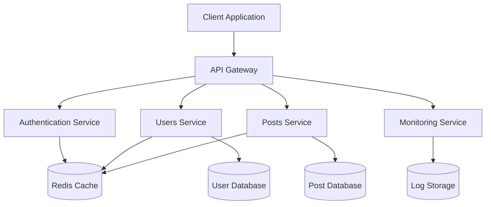

# REST API Documentation - Developer Demo

> **Preset:** `test-developer`  
> **Use Case:** Technical documentation and API references  
> **Features:** Code blocks, tables, mermaid diagrams, multiple headings, TOC

This document demonstrates technical writing patterns for developer documentation.

## Table of Contents

<!-- Use TOC creation tool to generate automatically -->

## Getting Started

### Authentication

All API requests require authentication using an API key. Include your key in the request header:

```http
GET /api/v1/users
Authorization: Bearer YOUR_API_KEY
Content-Type: application/json
```

### Base URL

```
https://api.example.com/v1
```

### Rate Limiting

- **Free tier**: 100 requests per hour
- **Pro tier**: 1,000 requests per hour  
- **Enterprise**: Unlimited

## Core Endpoints

### Users API

#### Get User by ID

```http
GET /users/{id}
```

**Parameters:**

| Parameter | Type | Required | Description |
|-----------|------|----------|-------------|
| `id` | integer | Yes | Unique user identifier |
| `include` | string | No | Comma-separated list of related data |

**Example Request:**

```bash
curl -X GET "https://api.example.com/v1/users/123" \
  -H "Authorization: Bearer YOUR_API_KEY" \
  -H "Content-Type: application/json"
```

**Example Response:**

```json
{
  "id": 123,
  "username": "johndoe",
  "email": "john@example.com",
  "created_at": "2024-01-15T10:30:00Z",
  "profile": {
    "first_name": "John",
    "last_name": "Doe",
    "avatar_url": "https://example.com/avatars/123.jpg"
  }
}
```

#### Create New User

```http
POST /users
```

**Request Body:**

```json
{
  "username": "newuser",
  "email": "user@example.com",
  "password": "securepassword123",
  "profile": {
    "first_name": "Jane",
    "last_name": "Smith"
  }
}
```

### Posts API

#### List Posts

```http
GET /posts
```

**Query Parameters:**

| Parameter | Type | Default | Description |
|-----------|------|---------|-------------|
| `page` | integer | 1 | Page number |
| `limit` | integer | 20 | Items per page (max 100) |
| `author_id` | integer | null | Filter by author |
| `tag` | string | null | Filter by tag |
| `sort` | string | "created_at" | Sort field |
| `order` | string | "desc" | Sort order (asc/desc) |

**Example with TypeScript:**

```typescript
interface PostResponse {
  id: number;
  title: string;
  content: string;
  author_id: number;
  tags: string[];
  created_at: string;
  updated_at: string;
}

async function fetchPosts(params: {
  page?: number;
  limit?: number;
  authorId?: number;
}): Promise<PostResponse[]> {
  const query = new URLSearchParams();
  if (params.page) query.set('page', params.page.toString());
  if (params.limit) query.set('limit', params.limit.toString());
  if (params.authorId) query.set('author_id', params.authorId.toString());

  const response = await fetch(`/api/v1/posts?${query}`, {
    headers: {
      'Authorization': `Bearer ${API_KEY}`,
      'Content-Type': 'application/json'
    }
  });

  return response.json();
}
```

## Data Models

### User Schema

```typescript
interface User {
  id: number;                    // Unique identifier
  username: string;              // Must be unique, 3-30 characters
  email: string;                 // Must be valid email format
  created_at: string;            // ISO 8601 timestamp
  updated_at: string;            // ISO 8601 timestamp
  profile: UserProfile;          // Embedded profile object
  preferences: UserPreferences;  // User settings
}

interface UserProfile {
  first_name: string;    // 1-50 characters
  last_name: string;     // 1-50 characters
  bio?: string;          // Optional, max 500 characters
  avatar_url?: string;   // Optional, must be valid URL
  location?: string;     // Optional, max 100 characters
}
```

### Response Format

All API responses follow this structure:

```json
{
  "success": true,
  "data": { /* actual response data */ },
  "meta": {
    "timestamp": "2024-03-15T14:30:00Z",
    "version": "1.0",
    "rate_limit": {
      "remaining": 95,
      "reset_at": "2024-03-15T15:00:00Z"
    }
  }
}
```

## Error Handling

### Error Response Format

```json
{
  "success": false,
  "error": {
    "code": "VALIDATION_ERROR",
    "message": "Invalid request parameters",
    "details": [
      {
        "field": "email",
        "message": "Must be a valid email address"
      }
    ]
  },
  "meta": {
    "timestamp": "2024-03-15T14:30:00Z",
    "request_id": "req_abc123"
  }
}
```

### HTTP Status Codes

| Status | Code | Description |
|--------|------|-------------|
| Success | 200 | Request successful |
| Created | 201 | Resource created |
| No Content | 204 | Request successful, no data |
| Bad Request | 400 | Invalid request format |
| Unauthorized | 401 | Authentication required |
| Forbidden | 403 | Insufficient permissions |
| Not Found | 404 | Resource not found |
| Rate Limited | 429 | Too many requests |
| Server Error | 500 | Internal server error |

## Architecture Overview



## SDK Examples

### JavaScript/Node.js

```javascript
const ApiClient = require('@example/api-client');

const client = new ApiClient({
  apiKey: 'your-api-key',
  baseUrl: 'https://api.example.com/v1'
});

// Get user
const user = await client.users.get(123);

// Create post
const newPost = await client.posts.create({
  title: 'My First Post',
  content: 'Hello, world!',
  tags: ['hello', 'world']
});
```

### Python

```python
from example_api import ApiClient

client = ApiClient(
    api_key='your-api-key',
    base_url='https://api.example.com/v1'
)

# Get user
user = client.users.get(123)

# Create post
new_post = client.posts.create(
    title='My First Post',
    content='Hello, world!',
    tags=['hello', 'world']
)
```

## Webhooks

### Webhook Events

| Event | Description | Payload |
|-------|-------------|---------|
| `user.created` | New user registration | User object |
| `user.updated` | User profile changes | User object |
| `post.created` | New post published | Post object |
| `post.updated` | Post content modified | Post object |

### Webhook Configuration

```bash
curl -X POST "https://api.example.com/v1/webhooks" \
  -H "Authorization: Bearer YOUR_API_KEY" \
  -H "Content-Type: application/json" \
  -d '{
    "url": "https://your-app.com/webhooks",
    "events": ["user.created", "post.created"],
    "secret": "your-webhook-secret"
  }'
```

## Testing

### Postman Collection

Download our [Postman collection](./api-collection.json) for easy API testing.

### Test Data

```json
{
  "test_users": [
    {
      "username": "testuser1",
      "email": "test1@example.com"
    },
    {
      "username": "testuser2", 
      "email": "test2@example.com"
    }
  ]
}
```

## Changelog

### Version 1.2.0 (2024-03-15)
- Added pagination to posts endpoint
- Improved error messages
- New webhook events

### Version 1.1.0 (2024-02-01)
- Added user preferences API
- Enhanced search functionality
- Bug fixes for rate limiting

### Version 1.0.0 (2024-01-15)
- Initial API release
- User management
- Post CRUD operations

---

## Testing Notes for Developers

This preset should excel at:

- ✅ **Code syntax highlighting** in multiple languages
- ✅ **Table creation** for parameters and data
- ✅ **Mermaid diagrams** for architecture visualization
- ✅ **Multiple heading levels** for documentation structure
- ✅ **TOC generation** for navigation
- ✅ **Inline code formatting** for technical terms

Perfect for API docs, technical guides, and developer-focused content!