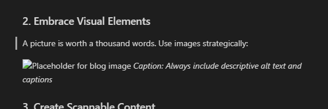

# 10 Tips for Better Markdown Writing - Blog Post Demo

> **Preset:** `test-blogger`  
> **Use Case:** Blog writing and article creation  
> **Features:** Rich formatting, images, links, horizontal rules, TOC

*Published on: March 15, 2024 | Reading time: 8 minutes | Tags: #markdown #writing #blogging*

---

Whether you're a seasoned blogger or just starting your writing journey, **markdown** has become the go-to format for creating content that's both readable and portable. In this post, I'll share my top 10 tips for writing better markdown content.

## Why Markdown Matters for Bloggers

Before we dive into the tips, let's talk about why markdown has become so popular among content creators:

- **Simplicity**: Focus on writing, not formatting
- **Portability**: Works across different platforms
- **Version control**: Perfect for collaborative writing
- **Future-proof**: Plain text will always be readable

*Fun fact: This entire blog is written in markdown!*

---

## The Top 10 Tips

### 1. Master the Heading Hierarchy

Good content structure starts with proper heading usage. Use headings to create a logical flow:

> **Pro tip:** Never skip heading levels. Go from H1 to H2 to H3, not H1 to H3 directly.

### 2. Embrace Visual Elements

A picture is worth a thousand words. Use images strategically:

*Caption: Always include descriptive alt text and captions*

### 3. Create Scannable Content

Readers scan before they read. Help them with:

- **Bullet points** for quick lists
- **Bold text** for key concepts  
- *Italic text* for emphasis
- ~~Strikethrough~~ for corrections or humor

### 4. Use Blockquotes Effectively

> Blockquotes aren't just for citations. Use them to:
> - Highlight key takeaways
> - Share reader testimonials
> - Add visual variety to your content

### 5. Link Strategically

Not all links are created equal. [Link to valuable resources](https://example.com) that enhance your content, don't just add links for the sake of it.

**Internal linking strategy:**
- Link to your related posts
- Create topic clusters
- Use descriptive anchor text

### 6. Code Formatting (Even for Non-Programmers)

Use `inline code` for:
- Software names: `WordPress`, `Notion`
- File names: `config.json`
- Keyboard shortcuts: `Ctrl+C`

### 7. Tables for Data Presentation

Sometimes a table says it better:

| Markdown Element | When to Use | Readability Impact |
|------------------|-------------|-------------------|
| Headers | Structure content | High |
| Lists | Scannable items | High |
| Links | External resources | Medium |
| Images | Visual explanation | Very High |

### 8. The Power of Horizontal Rules

Use horizontal rules to create natural breaks in your content, especially:

---

- Between major sections
- Before concluding thoughts
- After introductory content

### 9. Write for Your Future Self

> "Code is written once but read many times." The same applies to content.

Make your markdown clean and organized:
- Use consistent formatting
- Add helpful comments
- Structure for easy editing

### 10. Test Your Content

Before publishing:
- [ ] Preview in different markdown renderers
- [ ] Check all links are working
- [ ] Verify images load correctly  
- [ ] Test on mobile devices
- [ ] Read aloud for flow

---

## Conclusion

Mastering markdown isn't about memorizing syntax—it's about developing habits that make your content more engaging and accessible. Start with these 10 tips and gradually build your markdown toolkit.

**What's next?** Try implementing one new technique in your next blog post. Which tip resonates most with your writing style?

---

### About the Author

*This is a demo blog post for testing the blogger preset. The author bio would typically include links to social media, other posts, and a brief personal description.*

### Related Posts

- [Getting Started with Markdown: A Beginner's Guide](#)
- [Advanced Markdown Techniques for Power Users](#)
- [Building a Blog with Static Site Generators](#)

### Comments Section

*In a real blog, this is where reader engagement happens. Comments, shares, and feedback make blogging worthwhile.*

---

## Testing Notes for Bloggers

This preset should provide:

- ✅ **Rich text formatting** (bold, italic, strikethrough)
- ✅ **Multiple heading levels** for content structure
- ✅ **Image insertion tools** for visual content
- ✅ **Link creation** for external references
- ✅ **Blockquotes** for testimonials and highlights
- ✅ **Horizontal rules** for section breaks
- ✅ **Lists** for scannable content
- ✅ **Table of contents** generation for long posts

Perfect for bloggers, content creators, and anyone writing for online publication!