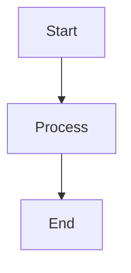

# Markdown Extended Toolbar Extension - UI/UX Design Documentation

## 🎨 Design Philosophy

### User-Centered Design Principles

The Markdown Extended Toolbar Extension is designed with a **progressive disclosure** approach, revealing contextually relevant actions while maintaining a clean, unobtrusive interface that enhances rather than interrupts the writing flow.

#### Core UX Principles

1. **Context Awareness**: Actions appear based on cursor position and document state
2. **Visual Hierarchy**: Clear distinction between active/inactive states using theme colors
3. **Discoverability**: Hover interactions reveal available actions without cluttering the interface
4. **Consistency**: Familiar iconography and interaction patterns aligned with VS Code conventions
5. **Accessibility**: Full keyboard navigation and screen reader support
6. **Performance**: Smooth, responsive interactions with minimal latency

## 🖥️ Interface Components

### Status Bar Toolbar

#### Design Rationale

The status bar provides persistent access to formatting tools while staying out of the editing area. This location offers:

- **Non-intrusive presence**: Doesn't compete with editor content
- **Consistent availability**: Always visible regardless of panel states
- **Theme integration**: Seamlessly blends with VS Code's native UI
- **Configurable positioning**: User choice between left/right alignment

#### Visual States

```typescript
interface ButtonState {
    active: boolean;      // Currently applied formatting
    available: boolean;   // Action available at cursor position
    disabled: boolean;    // Action not applicable in current context
}
```

**Active State** (`ThemeColor('statusBarItem.prominentBackground')`)
- Used when formatting is currently applied at cursor position
- Bold visual distinction helps users understand current state
- Consistent with VS Code's active item styling

**Available State** (Default styling)
- Standard button appearance when action is available
- Subtle hover effects to indicate interactivity
- Maintains visual hierarchy without overwhelming

**Disabled State** (Reduced opacity)
- Clearly indicates when actions aren't applicable
- Prevents confusion about non-functional buttons
- Follows VS Code's disabled element conventions

#### Button Layout Strategy

```
[🅱️] [🔤] [</> ] [🔗] [📝] [H+] [H-] [📊] [🎨]
 ↑     ↑     ↑     ↑     ↑     ↑     ↑     ↑     ↑
Bold  Italic Code  Link  List  H+   H-   Table Mermaid
```

**Left-to-Right Priority**:
1. **Basic Formatting**: Bold, Italic, Code (most frequent)
2. **Structure**: Links, Lists (moderate frequency)
3. **Headers**: H+/H- controls (context-dependent)
4. **Advanced**: Tables, Mermaid (specialized use)

### CodeLens Integration

#### Interactive Element Discovery

CodeLens providers appear above relevant content blocks, offering immediate access to contextual actions without requiring cursor positioning.

##### Mermaid Diagram Controls

```
🔍 Preview | ✏️ Edit | 📤 Export | ⚠️ Fix Syntax

```

**Design Considerations**:
- **Visual grouping**: Related actions clustered together
- **Icon semantics**: Universal symbols for immediate recognition
- **Error indication**: Warning icons for syntax issues
- **Progressive disclosure**: Advanced options in secondary menus

##### Header Level Controls

```
H+ Bigger | H- Smaller | 📑 Add to TOC
# Current Header Level 2
```

**UX Benefits**:
- **Immediate feedback**: Shows current header level
- **One-click adjustment**: No menu navigation required
- **TOC integration**: Seamless content organization
- **Visual consistency**: Matches VS Code's CodeLens styling

##### Table Management Controls

```
➕ Column | ➕ Row | 📐 Format | 🔽 Sort
| Header 1 | Header 2 | Header 3 |
|----------|----------|----------|
| Data 1   | Data 2   | Data 3   |
```

**User Flow Optimization**:
- **Action proximity**: Controls appear near content
- **Common operations first**: Add operations before formatting
- **Visual feedback**: Actions show immediate results
- **Undo support**: All operations are undoable

### Hover Interactions

#### Contextual Action Menus

Hover interactions provide detailed information and actions without disrupting the editing flow. Each hover menu is tailored to the specific element type.

##### Header Hover UI

```
📝 H2 (Section)
📄 Content: Introduction to Markdown

Actions:
⬆️ H+ Make Bigger (H1)
⬇️ H- Make Smaller (H3)
📑 Add to Table of Contents
🧭 Navigate Headers

Info:
📍 Line 5
🔢 Level 2/6
```

**Information Hierarchy**:
1. **Element identification**: Clear type and level indication
2. **Content preview**: Shows actual header text
3. **Available actions**: Primary operations prominently displayed
4. **Context information**: Technical details for power users

##### Table Hover UI

```
📊 Markdown Table
📐 Dimensions: 3 rows × 4 columns
👆 Current Column: 2/4

Actions:
➕ Add Column
➕ Add Row
📐 Format Table
🔽 Sort by Column
🛠️ Open Table Editor

Info:
📍 Line 12
📊 Table detected
```

**Contextual Intelligence**:
- **Current position awareness**: Highlights active column
- **Dimension feedback**: Immediate table size information
- **Action relevance**: Only shows applicable operations
- **External integration**: Links to specialized tools

##### Mermaid Hover UI

```
🎨 Mermaid Diagram (Flowchart)
✅ Status: Valid syntax

Actions:
🔍 Preview Diagram
✏️ Edit in Editor
📤 Export as Image
🎨 Open in Mermaid Editor

Info:
📍 Line 8
🎨 Type: Flowchart
📏 Lines: 6
```

**Error State Variant**:
```
🎨 Mermaid Diagram (Unknown)
⚠️ Status: Syntax errors detected
🐛 Error: Invalid diagram type

Actions:
⚠️ Fix Syntax Issues
✏️ Edit in Editor
📖 View Documentation

Info:
📍 Line 15
❌ Validation failed
```

## 🎯 Interaction Design Patterns

### Progressive Disclosure

#### Primary Actions (Always Visible)
- Status bar formatting buttons
- Basic CodeLens actions
- Essential hover commands

#### Secondary Actions (Contextual)
- Advanced formatting options
- External tool integration
- Diagnostic information

#### Tertiary Actions (On-Demand)
- Settings and configuration
- Help and documentation
- Debug information

### Feedback Mechanisms

#### Visual Feedback
- **Immediate state changes**: Button states update instantly
- **Animation cues**: Subtle transitions for state changes
- **Color coding**: Theme-integrated status indication
- **Icon semantics**: Universal symbols for action types

#### Informational Feedback
- **Tooltips**: Brief action descriptions on hover
- **Status messages**: Operation completion notifications
- **Error indications**: Clear problem identification
- **Progress indicators**: For longer operations

### Accessibility Design

#### Keyboard Navigation
- **Full keyboard access**: All actions accessible via keyboard
- **Logical tab order**: Intuitive navigation sequence
- **Shortcut keys**: Common formatting shortcuts supported
- **Focus indicators**: Clear visual focus states

#### Screen Reader Support
- **Semantic markup**: Proper ARIA labels and roles
- **State announcements**: Active/inactive state communication
- **Context information**: Element type and position details
- **Action descriptions**: Clear operation explanations

## 📱 Responsive Design

### Panel State Adaptations

#### Collapsed Panels
- Status bar maintains full functionality
- CodeLens actions remain available
- Hover interactions provide alternative access

#### Narrow Viewport
- Button icon prioritization
- Condensed text in hover menus
- Essential actions remain accessible

#### Wide Viewport
- Extended button labels
- Additional context information
- Enhanced hover menu details

## 🎨 Theme Integration

### VS Code Theme Compatibility

#### Dark Themes
- High contrast button states
- Optimized icon visibility
- Appropriate hover background colors
- Accessible text contrast ratios

#### Light Themes
- Subtle button distinctions
- Clear icon definitions
- Appropriate shadow effects
- Maintained readability

#### Custom Themes
- Automatic color adaptation
- ThemeColor API integration
- Fallback color schemes
- User customization support

### Color Semantic System

```typescript
interface ThemeColors {
    active: 'statusBarItem.prominentBackground';
    hover: 'statusBarItem.hoverBackground';
    text: 'statusBarItem.foreground';
    border: 'statusBarItem.border';
    error: 'statusBarItem.errorBackground';
    warning: 'statusBarItem.warningBackground';
}
```

## 🔄 User Flow Optimization

### Typical User Journeys

#### Quick Formatting Flow
1. **Selection**: User selects text
2. **Action**: Clicks formatting button or uses shortcut
3. **Feedback**: Button state changes, formatting applies
4. **Confirmation**: Visual indication of applied formatting

#### Table Creation Flow
1. **Trigger**: User types table markdown or uses command
2. **Detection**: System recognizes table structure
3. **Enhancement**: CodeLens actions appear above table
4. **Interaction**: User clicks to add columns/rows/formatting
5. **Integration**: Optional external table editor launch

#### Mermaid Diagram Flow
1. **Creation**: User creates mermaid code block
2. **Validation**: System checks syntax automatically
3. **Actions**: Preview/edit/export options appear
4. **Integration**: External mermaid tools available
5. **Export**: One-click image export functionality

### Friction Reduction Strategies

#### Contextual Availability
- Actions only appear when relevant
- No dead-end interactions
- Clear success/failure feedback
- Undo support for all operations

#### Smart Defaults
- Sensible formatting choices
- Context-appropriate suggestions
- User preference learning
- Minimal configuration required

#### Error Prevention
- Syntax validation before errors occur
- Clear constraint communication
- Helpful error messages
- Recovery action suggestions

## 📊 Performance Considerations

### UI Responsiveness

#### Debounced Updates
- Context detection debounced to 150ms
- UI updates batched for efficiency
- Smooth state transitions
- No blocking operations

#### Lazy Loading
- Providers activate only when needed
- Resources loaded on demand
- Memory efficient operation
- Quick startup times

### User Perception Optimization

#### Perceived Performance
- Immediate visual feedback
- Progressive loading indicators
- Optimistic UI updates
- Smooth animations (when appropriate)

#### Actual Performance
- Sub-100ms interaction response
- Efficient context detection algorithms
- Minimal DOM manipulation
- Resource cleanup on deactivation

This UI/UX design ensures that the Markdown Extended Toolbar Extension provides an intuitive, efficient, and enjoyable editing experience while maintaining the high standards expected in VS Code extensions.
