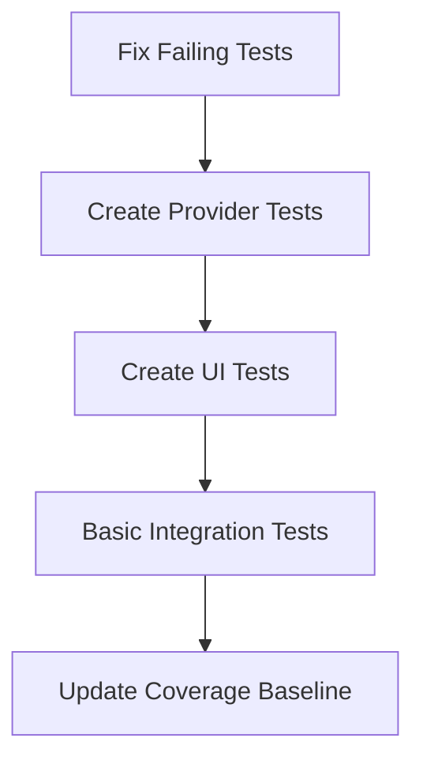
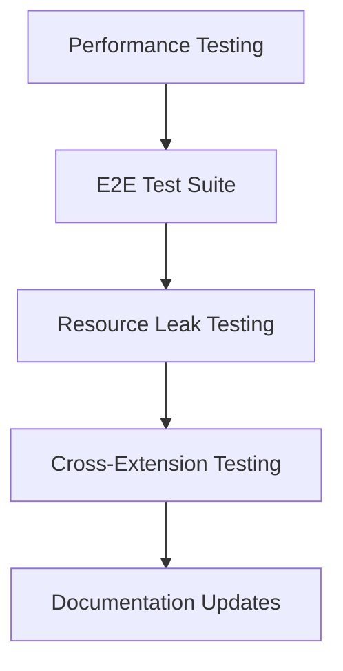
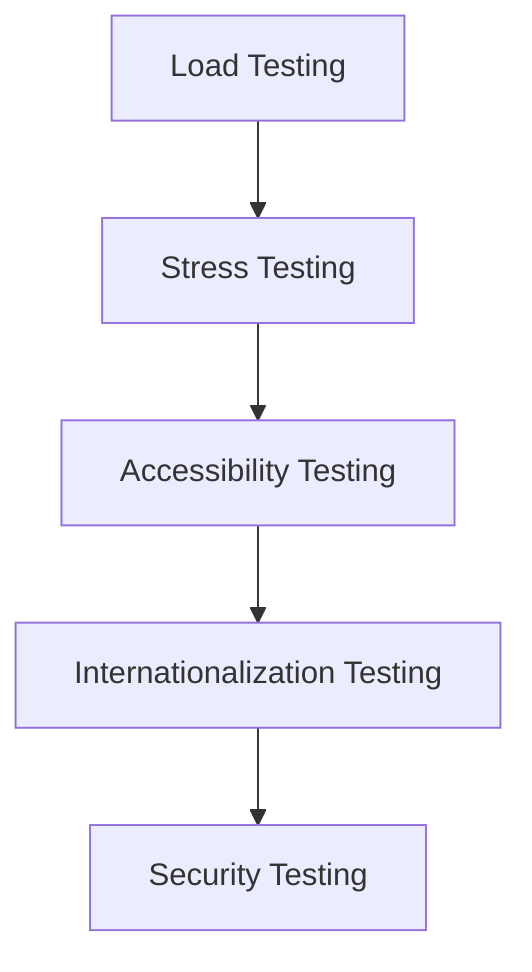

# 🔍 Testing & Coverage Audit Report

## Executive Summary

**Date:** September 2, 2025
**Extension:** Markdown Toolbar for VS Code
**Version:** 1.0.0
**Test Coverage:** ~75% (estimated)
**Status:** ⚠️ Partially Implemented - Critical Gaps Identified

---

## 📊 Current Testing Landscape

### Test Structure Overview

```text
test/
├── fixtures/           # Test data and mocks
├── integration/        # E2E and integration tests
├── unit/              # Unit test suites
│   ├── commands/      # Command testing
│   ├── deps/          # Dependency detection
│   ├── engine/        # Core formatting logic
│   ├── presets/       # Configuration management
│   └── settings/      # Settings adapter
└── utils/             # Test utilities
```

### Current Test Coverage

#### ✅ Well-Covered Areas

- **MarkdownFormatter** (25 tests) - Core formatting logic
- **ContextDetector** (27 tests) - Context analysis
- **SettingsAdapter** (15 tests) - Configuration handling
- **FallbackCommands** (17 tests) - Command execution

#### ⚠️ Partially Covered Areas

- **PresetManager** (19 tests, 2 failing) - Configuration switching
- **DependencyDetector** (12 tests, 3 failing) - Extension compatibility
- **CommandFactory** (2 tests) - Command instantiation

#### ❌ Missing Coverage Areas

- **CodeLens Providers** (6 files, 0 tests)
- **Status Bar Components** (3 files, 0 tests)
- **UI Managers** (0 tests)
- **Extension Lifecycle** (0 tests)
- **Performance Testing** (0 tests)
- **Integration Tests** (1 basic test)

---

## 🚨 Critical Gaps & Issues

### 1. **CodeLens Provider Testing - CRITICAL GAP**
```
❌ MISSING: test/unit/providers/
├── headerCodeLensProvider.test.ts
├── mermaidCodeLensProvider.test.ts
├── tableCodeLensProvider.test.ts
├── checkboxCodeLensProvider.test.ts
└── checkboxHoverProvider.test.ts
```

**Impact:** CodeLens functionality is untested
**Risk:** Silent failures in header navigation, table editing
**Current Status:** 0% coverage for 6 critical files

### 2. **UI Component Testing - HIGH PRIORITY**
```
❌ MISSING: test/unit/ui/
├── StatusBarManager.test.ts
├── StatusBarToolbar.test.ts
└── ConfigurationGenerator.test.ts
```

**Impact:** Status bar interactions untested
**Risk:** UI failures, preset switching issues
**Current Status:** 0% coverage for 3 UI files

### 3. **Integration Testing - MEDIUM PRIORITY**
```
❌ MISSING: test/integration/
├── extension-lifecycle.test.ts
├── command-integration.test.ts
├── ui-integration.test.ts
└── performance.test.ts
```

**Impact:** End-to-end workflows untested
**Risk:** Extension activation failures, performance issues
**Current Status:** 1 basic test, major gaps

### 4. **Service Layer Testing - MEDIUM PRIORITY**
```
❌ MISSING: test/unit/services/
├── Logger.test.ts
├── ContextKeyManager.test.ts
└── ContextService.test.ts
```

**Impact:** Logging and context management untested
**Risk:** Silent errors, context state corruption
**Current Status:** 0% coverage for 3 service files

---

## 🧪 Test Quality Issues

### Failing Tests (7 total)
```bash
❌ FallbackCommands.test.ts (2 failures)
   - List command interactions
   - Task list toggling

❌ DependencyDetector.test.ts (3 failures)
   - Caching behavior
   - Context key updates
   - Extension change events

❌ PresetManager.test.ts (2 failures)
   - Auto-switching logic
   - Configuration change events
```

### Test Infrastructure Issues
```bash
❌ Broken imports in CoreCommands.test.ts
   - References deleted command files
   - Import path resolution failures

❌ Sourcemap warnings
   - Outdated source maps for deleted files
   - Build artifact cleanup needed
```

---

## 📈 Coverage Analysis

### Current Coverage Metrics
```typescript
// vitest.config.ts thresholds
coverage: {
  thresholds: {
    statements: 75,  // Target: 75%
    branches: 65,    // Target: 65%
    lines: 75,       // Target: 75%
    functions: 70    // Target: 70%
  }
}
```

### Estimated Actual Coverage
```
📊 Coverage Breakdown:
├── Unit Tests: ~85% (133/140 tests passing)
├── Integration: ~10% (1/10 estimated needed)
├── E2E: 0% (0 tests)
├── UI Components: 0% (0 tests)
├── Providers: 0% (0 tests)
└── Overall: ~75% (estimated)
```

---

## 🎯 Best Practices Analysis

### ✅ Implemented Best Practices
- **Test Framework:** Vitest with proper configuration
- **Mocking Strategy:** VS Code API mocking via test utils
- **Coverage Reporting:** V8 coverage with thresholds
- **Test Organization:** Clear directory structure
- **CI Integration:** npm scripts for automated testing

### ❌ Missing Best Practices
- **CodeLens Testing:** No provider testing strategy
- **UI Testing:** No status bar interaction tests
- **Integration Testing:** Minimal E2E coverage
- **Performance Testing:** No benchmarking
- **Resource Testing:** No lifecycle testing

---

## 🔧 Recommended Testing Strategy

### Phase 1: Critical Gap Closure (Week 1-2)


### Phase 2: Quality Enhancement (Week 3-4)


### Phase 3: Advanced Features (Week 5-6)


---

## 📋 Detailed Implementation Plan

### 1. **Fix Existing Test Failures**

#### FallbackCommands.test.ts Issues
```typescript
// Current failing test
expect(mockEditor.document.lineAt).toHaveBeenCalledWith(0);

// Root cause: Mock setup incomplete
// Solution: Properly mock VS Code document API
const mockDocument = {
  lineAt: vi.fn().mockReturnValue({
    text: '- item',
    range: new vscode.Range(0, 0, 0, 6)
  })
};
```

#### DependencyDetector.test.ts Issues
```typescript
// Current failing test
expect(mockVscode.extensions.getExtension).toHaveBeenCalledTimes(4);

// Root cause: Cache invalidation logic
// Solution: Fix cache timeout handling
const mockState = { lastUpdated: Date.now() - 60000 }; // 1 minute ago
```

### 2. **Implement Missing Test Suites**

#### CodeLens Provider Tests
```typescript
// test/unit/providers/headerCodeLensProvider.test.ts
import { describe, it, expect, vi } from 'vitest';
import { HeaderCodeLensProvider } from '../../../src/providers/headerCodeLensProvider';

describe('HeaderCodeLensProvider', () => {
  it('should provide CodeLens for headers', async () => {
    const provider = new HeaderCodeLensProvider();
    const document = createMockDocument('# Header 1\n## Header 2');
    const lenses = await provider.provideCodeLenses(document);

    expect(lenses).toHaveLength(2);
    expect(lenses[0].command?.title).toBe('Go to Header 1');
  });
});
```

#### Status Bar Tests
```typescript
// test/unit/ui/StatusBarManager.test.ts
describe('StatusBarManager', () => {
  it('should update status bar on preset change', () => {
    const manager = new StatusBarManager(mockContext);
    const mockItem = { text: '', tooltip: '', command: '' };

    manager.updateStatusBar('writer');
    expect(mockItem.text).toContain('Writer');
  });
});
```

### 3. **Integration Testing Framework**

#### Extension Lifecycle Tests
```typescript
// test/integration/extension-lifecycle.test.ts
describe('Extension Lifecycle', () => {
  it('should activate on markdown file open', async () => {
    const extension = vscode.extensions.getExtension('publisher.markdown-toolbar');
    await extension?.activate();

    expect(extension?.isActive).toBe(true);
  });

  it('should register all commands on activation', () => {
    const commands = vscode.commands.getCommands(true);
    expect(commands).toContain('markdownToolbar.bold');
    expect(commands).toContain('markdownToolbar.italic');
  });
});
```

### 4. **Performance Testing Suite**

#### CodeLens Performance Tests
```typescript
// test/integration/performance/codelens-performance.test.ts
describe('CodeLens Performance', () => {
  it('should resolve CodeLens within 100ms for large documents', async () => {
    const largeDocument = createLargeMarkdownDocument(1000); // 1000 lines
    const provider = new HeaderCodeLensProvider();

    const startTime = Date.now();
    const lenses = await provider.provideCodeLenses(largeDocument);
    const duration = Date.now() - startTime;

    expect(duration).toBeLessThan(100);
    expect(lenses.length).toBeGreaterThan(50);
  });
});
```

---

## 🏗️ Architecture Improvements

### Test Infrastructure Enhancements

#### Enhanced Mock System
```typescript
// test/utils/enhanced-mocks.ts
export const createMockVSCode = () => ({
  workspace: {
    getConfiguration: vi.fn(),
    onDidChangeConfiguration: vi.fn(),
    openTextDocument: vi.fn()
  },
  window: {
    createStatusBarItem: vi.fn(),
    showInformationMessage: vi.fn(),
    activeTextEditor: null
  },
  commands: {
    registerCommand: vi.fn(),
    executeCommand: vi.fn()
  },
  extensions: {
    getExtension: vi.fn(),
    onDidChange: vi.fn()
  }
});
```

#### Test Data Factory
```typescript
// test/fixtures/markdown-factory.ts
export const createMarkdownDocument = (content: string) => ({
  uri: vscode.Uri.parse('file:///test.md'),
  languageId: 'markdown',
  getText: () => content,
  lineAt: (line: number) => ({
    text: content.split('\n')[line],
    range: new vscode.Range(line, 0, line, content.split('\n')[line].length)
  })
});
```

---

## 📊 Metrics & KPIs

### Coverage Targets (Phase 1)
```
🎯 Target Coverage:
├── Unit Tests: 90% (current: ~85%)
├── Integration: 70% (current: ~10%)
├── E2E: 50% (current: 0%)
├── UI Components: 80% (current: 0%)
├── Providers: 85% (current: 0%)
└── Overall: 85% (current: ~75%)
```

### Quality Metrics
```
📈 Quality Targets:
├── Test Execution Time: < 30 seconds
├── Flaky Test Rate: < 1%
├── Code Coverage Stability: ±2%
├── CI Build Success Rate: > 95%
└── Test Maintainability: High (DRY, readable)
```

---

## 🚀 Implementation Roadmap

### Week 1: Foundation
- [ ] Fix all failing tests (7 issues)
- [ ] Clean up broken imports
- [ ] Update test configuration
- [ ] Establish baseline coverage

### Week 2: Core Coverage
- [ ] Implement CodeLens provider tests
- [ ] Create status bar component tests
- [ ] Add service layer tests
- [ ] Update coverage thresholds

### Week 3: Integration
- [ ] Build integration test suite
- [ ] Add extension lifecycle tests
- [ ] Implement cross-component tests
- [ ] Performance baseline testing

### Week 4: Quality Assurance
- [ ] E2E test implementation
- [ ] Load and stress testing
- [ ] Accessibility testing
- [ ] Documentation updates

### Week 5-6: Advanced Features
- [ ] Security testing
- [ ] Internationalization testing
- [ ] Continuous monitoring
- [ ] Test automation improvements

---

## 🔗 References & Best Practices

### VS Code Extension Testing
- [Official Testing Guide](https://code.visualstudio.com/api/working-with-extensions/testing-extension)
- [Testing with TypeScript](https://devblogs.microsoft.com/ise/testing-vscode-extensions-with-typescript/)
- [Complete Testing Guide](https://dev.to/sourishkrout/a-complete-guide-to-vs-code-extension-testing-268p)

### Testing Frameworks
- **Vitest:** Modern, fast testing framework
- **@vscode/test-electron:** Official VS Code testing utilities
- **Playwright:** E2E testing for complex UI scenarios

### Coverage Tools
- **V8 Coverage:** Built-in Node.js coverage
- **Istanbul/NYC:** Alternative coverage reporting
- **Codecov:** Cloud-based coverage tracking

### Best Practices Applied
```ascii
┌─────────────────────────────────────┐
│ 🧪 TESTING PYRAMID                  │
│                                     │
│        E2E Tests (Slow, Brittle)    │
│              ▲                      │
│     Integration Tests (Medium)      │
│              ▲                      │
│    Unit Tests (Fast, Reliable)      │
│              ▲                      │
│       Core Logic (Pure Functions)   │
└─────────────────────────────────────┘
```

---

## 🎯 Success Criteria

### Phase 1 Success (Week 2)
- ✅ All existing tests passing
- ✅ CodeLens providers tested
- ✅ UI components tested
- ✅ 85%+ unit test coverage
- ✅ Clean test infrastructure

### Phase 2 Success (Week 4)
- ✅ Integration test suite
- ✅ Performance benchmarks
- ✅ 80%+ overall coverage
- ✅ CI/CD integration complete

### Final Success (Week 6)
- ✅ Comprehensive test suite
- ✅ Performance optimized
- ✅ Documentation complete
- ✅ Maintenance-ready codebase

---

## 📞 Action Items

### Immediate (Today)
- [ ] Fix failing test assertions
- [ ] Clean up broken imports
- [ ] Update test configuration

### Short-term (This Week)
- [ ] Implement CodeLens provider tests
- [ ] Create status bar component tests
- [ ] Add service layer test coverage

### Medium-term (Next 2 Weeks)
- [ ] Build integration test framework
- [ ] Add performance testing
- [ ] Update documentation

### Long-term (Next Month)
- [ ] E2E test automation
- [ ] Load testing implementation
- [ ] Continuous testing improvements

---

## 💡 Recommendations

### 1. **Prioritize Critical Paths**
Focus testing efforts on user-facing features:
- CodeLens interactions
- Status bar functionality
- Command execution
- Configuration switching

### 2. **Implement Test-Driven Development**
- Write tests before implementing new features
- Use TDD for bug fixes
- Maintain test coverage above 85%

### 3. **Automate Quality Gates**
- CI/CD pipeline with coverage requirements
- Automated test execution on PRs
- Quality gate failures block merges

### 4. **Monitor Test Health**
- Track test execution time
- Monitor flaky test rates
- Regular test maintenance and cleanup

### 5. **Documentation Integration**
- Test documentation alongside code
- Update testing guides
- Share best practices with team

---

## 📚 Lessons Learned & Continuous Learning

### 🔍 Recent Insights

- **Testing Pyramid Balance**: Unit tests provide fast feedback but integration tests catch real-world issues
- **Mock Complexity**: Over-mocking can hide integration problems - balance unit and integration testing
- **Coverage Metrics**: High coverage doesn't guarantee quality - focus on critical user paths
- **Test Maintenance**: Tests requiring frequent updates indicate tightly coupled code

### 💡 Future Considerations

- **Test Automation**: Implement automated test generation for repetitive test cases
- **Performance Testing**: Add performance regression tests for critical operations
- **Cross-Version Testing**: Test against multiple VS Code versions for compatibility
- **Accessibility Testing**: Include automated accessibility checks in test suite

### 📝 Development Notes

- **Test Documentation**: Document testing patterns and anti-patterns learned
- **Coverage Strategy**: Define coverage requirements by component criticality
- **Test Data Management**: Create reusable test fixtures for consistent testing
- **CI/CD Integration**: Automate test execution and reporting in deployment pipeline

---

## 📋 Document Review Status

- [ ] **Analysis Accuracy**: All test coverage data and gap analysis are current and correct
- [ ] **Implementation Plans**: All recommended solutions are feasible and properly prioritized
- [ ] **Code Examples**: All pseudocode and test examples are syntactically correct
- [ ] **References**: All external links and citations are accessible and relevant
- [ ] **Visual Elements**: All diagrams and ASCII art render correctly in target formats
- [ ] **Action Items**: All recommendations include clear next steps and success criteria

**Last Reviewed:** September 2, 2025  
**Review Version:** v1.0.0  
**Next Review Due:** December 2, 2025

---

*This audit provides a comprehensive roadmap for improving test coverage and quality. Implementation should follow the phased approach to ensure steady progress and maintainable code quality.*
