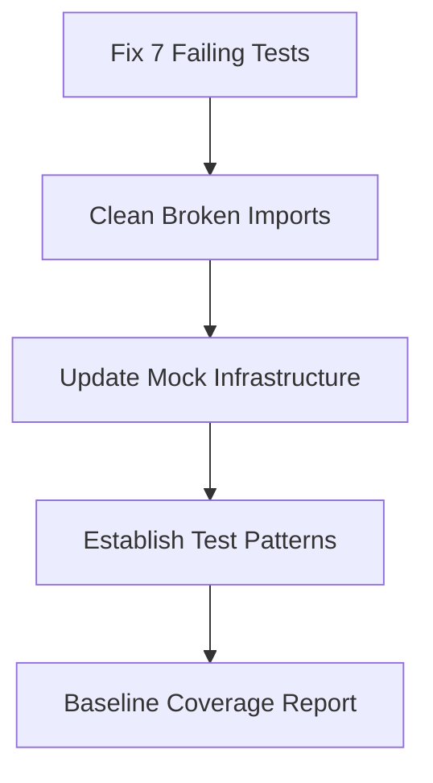
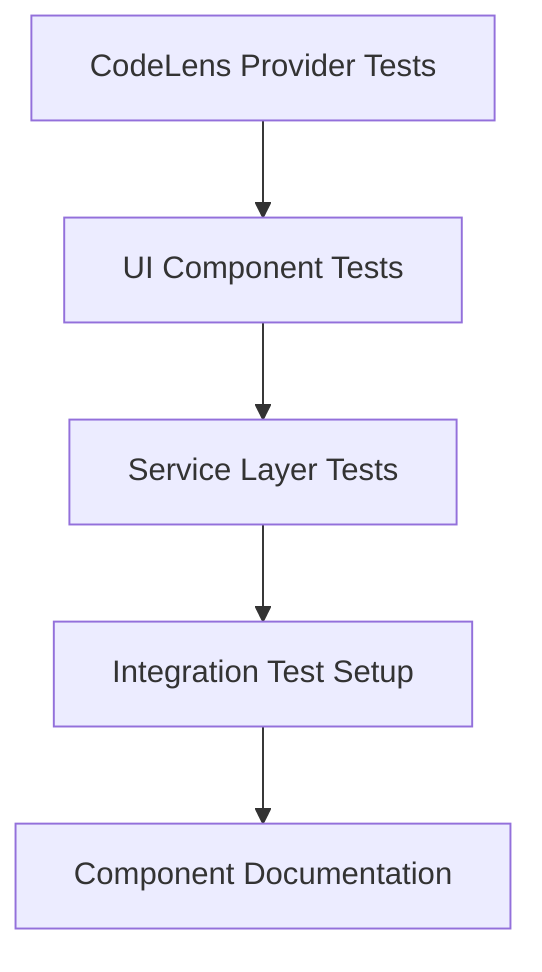
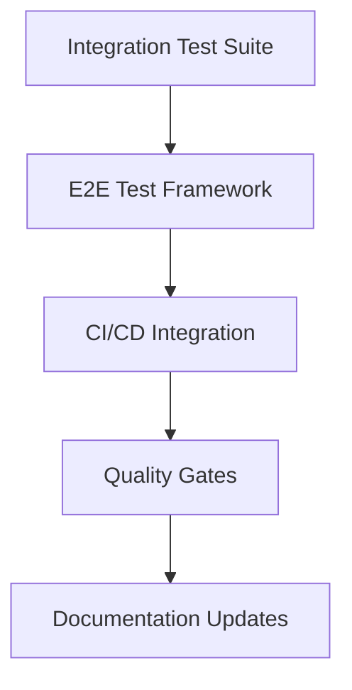

# 🧪 Comprehensive Testing Implementation Plan

## Executive Summary

**Mission**: Transform our markdown toolbar extension testing from 75% coverage with 7 failing tests to 85%+ coverage with comprehensive test patterns across all components.

**Scope**: All testing levels (Unit → Integration → E2E) with automated CI/CD integration and systematic gap closure.

**Approach**: AI-agent driven implementation with scaffolded patterns, automated tracking, and maintainable test infrastructure.

---

## 📊 Current State Analysis

### Coverage Gaps Identified
```
🎯 Critical Gaps (0% Coverage):
├── CodeLens Providers (6 files)
├── UI Components (3 files) 
├── Services (3 files)
└── Integration Testing (minimal)

❌ Failing Tests (7 total):
├── FallbackCommands.test.ts (2 failures)
├── DependencyDetector.test.ts (3 failures)
└── PresetManager.test.ts (2 failures)

🔧 Infrastructure Issues:
├── Broken imports in CoreCommands.test.ts
├── Outdated sourcemaps
└── Incomplete mock setup
```

### Target State
```
✅ Target Coverage:
├── Unit Tests: 90% (current: ~85%)
├── Integration: 80% (current: ~10%)
├── Component Tests: 85% (current: 0%)
├── E2E: 60% (current: 0%)
└── Overall: 85%+ (current: ~75%)
```

---

## 🏗️ Implementation Architecture

### Testing Stack
```typescript
// Primary Testing Framework
- Vitest: Unit testing with coverage
- @vscode/test-electron: Integration testing
- Playwright: E2E testing
- Sinon: Mocking and stubbing
- GitHub Actions: CI/CD automation
```

### Testing Patterns by Component Type

#### 1. **CodeLens Providers** (6 components)
```typescript
// Pattern: Provider Registration + Command Execution
describe('CodeLensProvider', () => {
  beforeEach(() => {
    // Setup mock document and VS Code APIs
  });
  
  it('should provide CodeLenses for markdown blocks', async () => {
    // Test: provideCodeLenses returns expected lenses
  });
  
  it('should resolve CodeLens commands correctly', async () => {
    // Test: resolveCodeLens executes proper commands
  });
  
  it('should handle provider lifecycle events', () => {
    // Test: registration/unregistration
  });
});
```

#### 2. **UI Components** (3 components)
```typescript
// Pattern: UI State + Event Handling
describe('StatusBarComponent', () => {
  it('should create status bar items on activation', () => {
    // Test: component initialization
  });
  
  it('should update visibility based on context', () => {
    // Test: context-aware behavior
  });
  
  it('should handle user interactions', () => {
    // Test: click handlers and command execution
  });
});
```

#### 3. **Services** (3 components)
```typescript
// Pattern: Service Logic + Dependency Injection
describe('ServiceComponent', () => {
  it('should initialize with correct dependencies', () => {
    // Test: constructor injection and setup
  });
  
  it('should handle service lifecycle', () => {
    // Test: start/stop/dispose patterns
  });
  
  it('should manage state correctly', () => {
    // Test: state management and persistence
  });
});
```

---

## 📋 Phase Implementation Plan

### **Phase 1: Foundation & Failing Tests** (Priority: Critical)


**Deliverables:**
- [ ] All existing tests passing
- [ ] Clean test infrastructure
- [ ] Documented test patterns
- [ ] Automated coverage reporting

### **Phase 2: Component Coverage** (Priority: High)


**Deliverables:**
- [ ] 85%+ unit test coverage
- [ ] Component test templates
- [ ] Integration test framework
- [ ] Per-component test docs

### **Phase 3: Integration & E2E** (Priority: Medium)


**Deliverables:**
- [ ] Integration test coverage
- [ ] E2E workflow testing
- [ ] Automated CI/CD pipeline
- [ ] Quality gate enforcement

---

## 🎯 Component-Specific Test Strategies

### CodeLens Providers (`src/providers/`)
**Files**: `BlockCodeLensProvider.ts`, `HeadingCodeLensProvider.ts`, etc.

**Test Strategy:**
```typescript
// Core Test Patterns
1. Provider Registration/Unregistration
2. CodeLens Generation (provideCodeLenses)
3. Command Resolution (resolveCodeLens) 
4. Document Context Awareness
5. Performance with Large Documents

// Negative Test Cases
- Invalid document types
- Malformed markdown content
- Provider disposal edge cases
- Command execution failures
```

**Mock Requirements:**
- `vscode.languages.registerCodeLensProvider`
- `vscode.TextDocument` with markdown content
- `vscode.commands.executeCommand`

### UI Components (`src/ui/`)
**Files**: `StatusBarManager.ts`, `StatusBarToolbar.ts`, `ConfigurationGenerator.ts`

**Test Strategy:**
```typescript
// Core Test Patterns
1. Component Initialization
2. Status Bar Item Management
3. Context-Aware Visibility
4. User Interaction Handling
5. Configuration Updates

// Negative Test Cases
- Invalid configuration values
- Missing VS Code APIs
- Disposal without initialization
- Theme/context changes
```

**Mock Requirements:**
- `vscode.window.createStatusBarItem`
- `vscode.workspace.getConfiguration`
- Event emitters for context changes

### Services (`src/services/`)
**Files**: `Logger.ts`, `ContextKeyManager.ts`, `ContextService.ts`

**Test Strategy:**
```typescript
// Core Test Patterns
1. Service Initialization
2. Dependency Injection
3. State Management
4. Event Handling
5. Resource Cleanup

// Negative Test Cases
- Invalid dependencies
- Service startup failures
- Memory leak scenarios
- Concurrent access issues
```

---

## 📈 Automated Tracking & Metrics

### Test Inventory Tracking
**CSV 1: Test Coverage Tracker**
```csv
Component,File,Current_Coverage,Target_Coverage,Test_Count,Status,Priority
Providers,BlockCodeLensProvider.ts,0%,85%,0,Not_Started,Critical
Providers,HeadingCodeLensProvider.ts,0%,85%,0,Not_Started,Critical
UI,StatusBarManager.ts,0%,80%,0,Not_Started,High
...
```

### Implementation Progress Tracking  
**CSV 2: Implementation Progress**
```csv
Phase,Task,Component,Assigned_Agent,Status,Completion_Date,Notes
Phase1,Fix_Failing_Tests,FallbackCommands,Agent1,In_Progress,,Mock setup issues
Phase1,Clean_Imports,CoreCommands,Agent2,Not_Started,,Broken import paths
Phase2,CodeLens_Tests,BlockProvider,Agent3,Not_Started,,Waiting for Phase1
...
```

---

## 🔧 Test Infrastructure Setup

### Vitest Configuration Updates
```typescript
// vitest.config.ts enhancements
export default defineConfig({
  test: {
    coverage: {
      reporter: ['text', 'json', 'html', 'lcov'],
      thresholds: {
        statements: 85,
        branches: 75, 
        lines: 85,
        functions: 80
      },
      exclude: [
        'test/**',
        'dist/**',
        '**/*.d.ts'
      ]
    },
    setupFiles: ['./test/setup.ts'],
    testTimeout: 10000
  }
});
```

### GitHub Actions Integration
```yaml
# .github/workflows/test.yml
name: Test Suite
on: [push, pull_request]
jobs:
  test:
    runs-on: ubuntu-latest
    strategy:
      matrix:
        vscode-version: ['stable', '1.85.0']
    steps:
      - uses: actions/checkout@v4
      - uses: actions/setup-node@v4
      - run: npm ci
      - run: npm run test:unit
      - run: npm run test:integration
      - run: npm run test:coverage
      - uses: codecov/codecov-action@v3
```

---

## 📚 Documentation Structure

### Per-Component Test Documentation
```
docs/testing/components/
├── codelens-providers.md
├── ui-components.md
├── services.md
├── integration-patterns.md
└── e2e-workflows.md
```

### Testing Guides
```
docs/testing/guides/
├── mock-strategies.md
├── test-patterns.md
├── ci-cd-setup.md
└── troubleshooting.md
```

---

## 🎯 Success Criteria & Quality Gates

### Coverage Targets
- **Unit Tests**: 90%+ coverage with comprehensive edge cases
- **Integration**: 80%+ coverage of VS Code API interactions  
- **E2E**: 60%+ coverage of critical user workflows
- **Component**: 85%+ coverage of all UI and provider components

### Quality Metrics
- **Test Execution Time**: <60 seconds for full suite
- **Flaky Test Rate**: <1% failure rate in CI
- **Test Maintainability**: Clear, documented test patterns
- **CI Success Rate**: >98% green builds

### Automated Quality Gates
- Coverage thresholds enforced in CI
- No failing tests block merges
- Linting and type checking pass
- Documentation updates with code changes

---

**Next Steps**: Begin Phase 1 implementation with failing test fixes and infrastructure setup. Each phase will be tracked via CSV spreadsheets and documented with component-specific testing strategies.

---

## 📋 Document Review Status

- [ ] **Implementation Plan**: All phases and deliverables clearly defined
- [ ] **Component Strategies**: Each component type has specific test patterns
- [ ] **Infrastructure Setup**: CI/CD and tooling properly configured
- [ ] **Tracking Systems**: CSV spreadsheets capture all necessary metrics
- [ ] **Quality Gates**: Success criteria and thresholds established
- [ ] **Documentation**: Testing guides and patterns documented

**Last Reviewed:** September 2, 2025  
**Review Version:** v1.0.0  
**Next Review Due:** December 2, 2025
